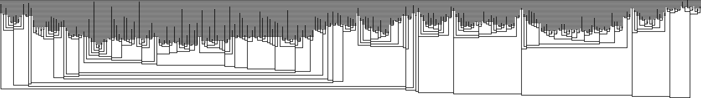
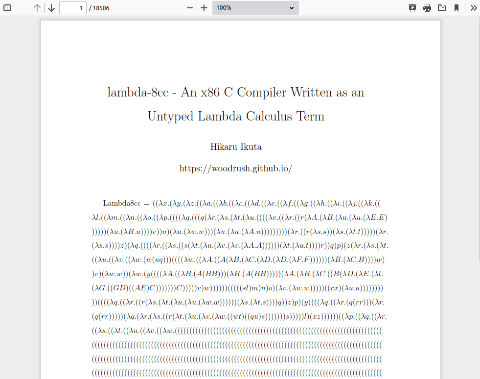
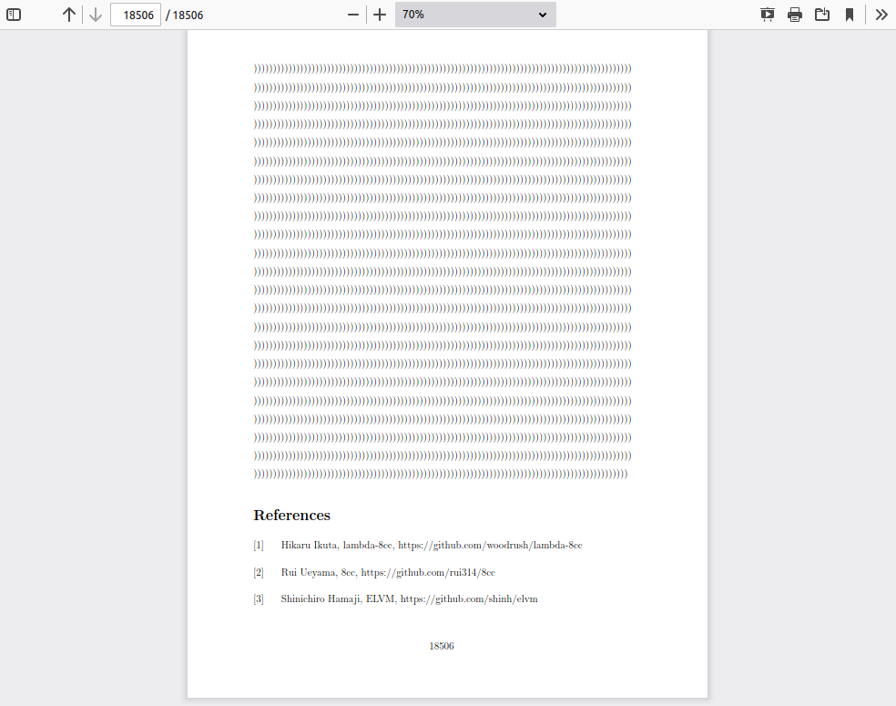

# lambda-8cc - An x86 C Compiler Written in Untyped Lambda Calculus



[](https://github.com/woodrush/lambda-8cc/actions/workflows/build.yml)

lambda-8cc is an x86 C compiler written as a monolithic closed untyped lambda calculus term.

When printed on letter-sized paper, it becomes 18,506 pages long on a 22 MB PDF without any figures.
The PDF can be seen on my GitHub Pages [here](https://woodrush.github.io/lambda-8cc.pdf).
The LaTeX source is 448 MB, and the LaTeX compilation log file `main.log` is 284 MB. I couldn't believe LaTeX was able to do that.

This gigantic lambda calculus term is a C compiler. Here is [rot13.c](examples/rot13.c), a program that compiles on GCC with no errors.
The same program can be compiled using lambda-8cc producing the x86 executable [rot13.bin](out/rot13.bin), runnable on x86/x86-64 Linux:

```sh
$ echo 'Hello, world!' | ./rot13.bin
Uryyb, jbeyq!
$ echo 'Uryyb, jbeyq!' | ./rot13.bin
Hello, world!
```

Despite its massive size, compiling rot13.c finishes in 8 minutes on my machine using a lambda calculus interpreter.
You can try it out on your own PC by cloning this repo.
Running time stats are summarized in the [Running Times and Memory Usage](#running-times-and-memory-usage) section.
Note that although the compilation takes time, the compiled binary runs instantaneously.

<!-- A zipped plaintext file is also available in this repo [here](./bin/lambda-8cc.lam.zip). -->

### Additional Feature: C to Lambda Calculus
As an additional feature, not only can lambda-8cc compile C to x86, but it can also compile C to lambda calculus terms, producing something like [rot13.lam](out/rot13.lam). Compiled lambda terms run on the same lambda calculus interpreter used to run lambda-8cc itself.

Using its [compilation options](#compilation-options), lambda-8cc can compile C to 5 different formats. Here is a full list of its features:

- Compile C to:
  - x86 executable (a.out)
  - Lambda calculus term (runs on the same interpreter as lambda-8cc)
  - [Binary lambda calculus](https://tromp.github.io/cl/Binary_lambda_calculus.html) program
  - [SKI combinator calculus](https://en.wikipedia.org/wiki/SKI_combinator_calculus) term (runnable as a [Lazy K](https://tromp.github.io/cl/lazy-k.html) program)
  - [ELVM](https://github.com/shinh/elvm) assembly listing (example: [rot13.s](out/rot13.s))
- Compile ELVM assembly to:
  - x86/lambda calculus/BLC/SKI combinator calculus (all of the above)

Among the list is [Lazy K](https://tromp.github.io/cl/lazy-k.html), a minimal purely functional language with only 4 built-in operators,
similar to the minimal imperative language [BF](https://en.wikipedia.org/wiki/Brainfuck) which only has 8 instructions.
I have covered a little bit about it in [my blog post](https://woodrush.github.io/blog/lambdalisp.html#lazy-k) as well.


lambda-8cc is based on the following 3 projects:
The first one is [LambdaVM](https://github.com/woodrush/lambdavm) written by the author of this repo [Hikaru Ikuta](https://github.com/woodrush),
a programmable virtual CPU written as an untyped lambda calculus term.
This is combined with [8cc](https://github.com/rui314/8cc) by [Rui Ueyama](https://github.com/rui314),
and a modified version of [ELVM](https://github.com/shinh/elvm) by [Shinichiro Hamaji](https://github.com/shinh).

## Gallery
The first page of the PDF looks like this. Notice the page count on the top left:



Its grand finale is a round of applause by a page full of right parentheses:




## Overview
### Lambdas All the Way Down
lambda-8cc is written as a closed untyped lambda calculus term ${\rm lambda8cc} = \lambda x. \cdots$ which takes an input string $x$ representing a C program and outputs an x86 Linux ELF executable expressed as a list of bytes.

Here, even strings are encoded as lambda terms. Characters and bytes are encoded as a list of bits with $0 = \lambda x. \lambda y.x$, $1 = \lambda x. \lambda y.y$,
and lists are encoded in the [Scott encoding](https://en.wikipedia.org/wiki/Mogensen%E2%80%93Scott_encoding) with ${\rm cons} = \lambda x.\lambda y.\lambda f.(f x y)$, ${\rm nil} = \lambda x.\lambda y.y$.

Therefore, _everything_ in the computation process, even including integers, is closed in the world of pure lambda terms,
without the need of introducing any non-lambda type object whatsoever.
It doesn't use any primitive types other than lambdas.
lambda-8cc makes [beta reduction](https://en.wikipedia.org/wiki/Lambda_calculus#%CE%B2-reduction) the sole requirement for compiling C to x86.
Note that the process doesn't depend on the choice of variable names as well.
Instead of encoding the character `A` as a variable with the name $A$, `A` is encoded as a list of bits of its ASCII encoding `01000001`.

The encoding process is a little cumbersome to say at the least to do by hand.
This can be solved by using a lambda calculus interpreter.
Various lambda calculus interpreters automatically handle this I/O format so that it runs on the terminal - standard input is encoded into lambda terms, and the output lambda term is decoded and shown on the terminal.
Using these interpreters, lambda-8cc can be run on the terminal to compile C programs just like GCC.

For further details on how I/O is handled and how programs are written in lambda calculus,
please see the implementation details of my other project [LambdaLisp](https://github.com/woodrush/lambdalisp),
a Lisp interpreter written as an untyped lambda calculus term.


### C to Lambda Calculus
In addition to x86, lambda-8cc can compile C to lambda calculus as well.
The output program runs on the same lambda calculus interpreter used to run lambda-8cc itself.
Compiled lambda terms also run on minimal interpreters such as the 521-byte lambda calculus interpreter [SectorLambda](https://justine.lol/lambda/) written by [Justine Tunney](https://github.com/jart),
and the [IOCCC](https://www.ioccc.org/) 2012 ["Most functional"](https://www.ioccc.org/2012/tromp/hint.html) interpreter written by [John Tromp](https://github.com/tromp) (its [source](https://www.ioccc.org/2012/tromp/tromp.c) is in the shape of a λ).
This makes lambda-8cc self-contained in the realm of lambda calculus.

It has long been known in computer science that lambda calculus is Turing-complete.
lambda-8cc demonstrates this in a rather straightforward way by showing that C programs can directly be compiled into lambda calculus terms.

The nice thing about lambda calculus is that the language specs are extremely simple.
With lambda-8cc, we are preserving knowledge about how to compile C in a timeless method.
Even if humanity loses knowledge about the x86 instruction set,
as long as we remember the rules for lambda calculus and have [the lambda term for lambda-8cc](./bin/lambda-8cc.lam.zip),
we can still use the entire C language through lambda-8cc and build everything on top of it again.


## Basic Usage Example
Here is a program [rot13.c](examples/rot13.c) that encodes/decodes standard input to/from the [ROT13](https://en.wikipedia.org/wiki/ROT13) cipher.
It compiles without errors using GCC:

```c
// rot13.c: Encodes/decodes standard input to/from the ROT13 cipher

#define EOF -1

int putchar(int c);
char getchar(void);

char c;
int offset;

int main (void) {
    for (;;) {
        c = getchar();
        if (c == EOF) {
            break;
        }

        offset = 0;
        if (('a' <= c && c < 'n') || ('A' <= c && c < 'N')) {
            offset = 13;
        } else if (('n' <= c && c <= 'z') || ('N' <= c && c <= 'Z')) {
            offset = -13;
        }
        putchar(c + offset);
    }
    return 0;
}
```

The same program can be compiled by lambda-8cc out of the box as follows.


### Build the Tools
First build the tools and prepare lambda-8cc:

```sh
$ make tools  # Build the interpreter uni++ and the tools lam2bin, asc2bin
$ unzip bin/lambda-8cc.lam.zip
$ cat lambda-8cc.lam | bin/lam2bin | bin/asc2bin > lambda-8cc.Blc  # Prepare format for uni++
```

The requirements are:

- `clang++` for building `uni++`
- `gcc` or `cc` for building `lam2bin` and `asc2bin`

The tools built here are:

- `uni++`: A very fast [lambda calculus interpreter](https://github.com/melvinzhang/binary-lambda-calculus) written by [Melvin Zhang](https://github.com/melvinzhang).
- `lam2bin`: A utility written by [Justine Tunney](https://github.com/jart) (available at [https://justine.lol/lambda/](https://justine.lol/lambda/)),
   that converts plaintext lambda calculus notation such as `\x.x` to [binary lambda calculus](https://tromp.github.io/cl/Binary_lambda_calculus.html#Lambda_encoding) notation,
   the format accepted by uni++.
- `asc2bin`: A utility that packs the 0/1 ASCII bitstream to bytes.

The tools are build via the [lambda calculus development kit](https://github.com/woodrush/lambda-calculus-devkit).

The conversion from lambda-8cc.lam to lambda-8cc.Blc is simply a transformation of notation for a format that's accepted by the interpreter uni++.
Details are described in [details.md](details.md#what-is-lambda-8ccblc).


### Compile the Program Using lambda-8cc
Then rot13.c can be compiled as:

```sh
$ cat lambda-8cc.Blc examples/rot13.c | bin/uni++ -o > a.out
$ chmod 755 a.out

$ echo 'Hello, world!' | ./a.out
Uryyb, jbeyq!
$ echo 'Uryyb, jbeyq!' | ./a.out
Hello, world!
```

This runs in about 8 minutes on my machine. But be careful - it takes 145 GB of memory to run it!
If you have free storage space or a USB drive, you can use a [swap file](https://askubuntu.com/questions/178712/how-to-increase-swap-space)
with `mkswap` and `swapon` to extend the swap without configuring the partition settings.
Also, by compiling the assembly and x86 executable separately, you can halve the RAM usage to 65 GB, as shown in the [Detailed Usage](#detailed-usage) section.
Small programs such as [putchar.c](examples/putchar.c) only take about 40 GB of memory.
I suspect that the RAM usage can be decreased by introducing a mark-and-sweep GC to the interpreter,
although I haven't confirmed it yet.

More running time stats are available in the [Running Times and Memory Usage](#running-times-and-memory-usage) section.
More example C programs compilable by lambda-8cc can be found under [./examples](./examples).

Other compilation options are described in the [Detailed Usage](#detailed-usage) section.


## Detailed Usage
### Compilation Options
Being written in lambda calculus, naturally, lambda-8cc's compilation options are expressed as lambda calculus terms as well.
These options can be used to unlock the full features of lambda-8cc.

Compilation options are used by applying an optional term as `(lambda-8cc option)` beforehand of the input. This changes the behavior of the lambda term `lambda-8cc` so that it accepts/produces a different input/output format.


Here are all of lambda-8cc's compilation options:

| Input         | Output                                          | Compilation Option                                                                                                      |
|---------------|-------------------------------------------------|----------------------------------------------------------------------------------------------------------------------|
| C             | x86 executable                                  | $\lambda f. (f ~ (\lambda x. \lambda y. x) ~ (\lambda x.\lambda y.\lambda z.\lambda a.\lambda b.x) ~ (\lambda x.x))$ |
| C             | Plaintext lambda calculus term                  | $\lambda f. (f ~ (\lambda x. \lambda y. x) ~ (\lambda x.\lambda y.\lambda z.\lambda a.\lambda b.y) ~ (\lambda x.x))$ |
| C             | Binary lambda calculus notation (BLC program)   | $\lambda f. (f ~ (\lambda x. \lambda y. x) ~ (\lambda x.\lambda y.\lambda z.\lambda a.\lambda b.z) ~ (\lambda x.x))$ |
| C             | SKI combinator calculus (Lazy K program)        | $\lambda f. (f ~ (\lambda x. \lambda y. x) ~ (\lambda x.\lambda y.\lambda z.\lambda a.\lambda b.a) ~ (\lambda x.x))$ |
| C             | ELVM assembly                                   | $\lambda f. (f ~ (\lambda x. \lambda y. x) ~ (\lambda x.\lambda y.\lambda z.\lambda a.\lambda b.b) ~ (\lambda x.x))$ |
| ELVM assembly | x86 executable                                  | $\lambda f. (f ~ (\lambda x. \lambda y. y) ~ (\lambda x.\lambda y.\lambda z.\lambda a.\lambda b.x) ~ (\lambda x.x))$ |
| ELVM assembly | Plaintext lambda calculus term                  | $\lambda f. (f ~ (\lambda x. \lambda y. y) ~ (\lambda x.\lambda y.\lambda z.\lambda a.\lambda b.y) ~ (\lambda x.x))$ |
| ELVM assembly | Binary lambda calculus notation (BLC program)   | $\lambda f. (f ~ (\lambda x. \lambda y. y) ~ (\lambda x.\lambda y.\lambda z.\lambda a.\lambda b.z) ~ (\lambda x.x))$ |
| ELVM assembly | SKI combinator calculus (Lazy K program)        | $\lambda f. (f ~ (\lambda x. \lambda y. y) ~ (\lambda x.\lambda y.\lambda z.\lambda a.\lambda b.a) ~ (\lambda x.x))$ |

Each option is in the format of a 3-tuple ${\rm cons3} ~ {\rm input} ~ {\rm output} ~ X$ where ${\rm cons 3} = \lambda x. \lambda y. \lambda z. \lambda f. (f x y z)$.
The first element ${\rm input}$ is a selector of a 2-tuple specifying the input format.
The second element ${\rm output}$ is a selector of a 5-tuple specifying the output format.
The third element $X = \lambda x.x$ is a placeholder used to distinguish the data structure from the standard input,
also existing for backward portability in the case when more options are added in the future.


### Applying Compilation Options
The compilation options shown before can be used in the terminal as follows.

To compile C to an ELVM assembly listing `a.s`:
```sh
( ( cat lambda-8cc.lam; printf '(\\f.(f (\\x.\\y.x) (\\x.\\y.\\z.\\a.\\b.b) (\\x.x)))' ) \
  | bin/lam2bin | bin/asc2bin; cat input.c ) | bin/uni++ -o > a.s
```

To compile an ELVM assembly listing `a.s` to x86 executable `a.out`:
```sh
( ( cat lambda-8cc.lam; printf '(\\f.(f (\\x.\\y.y) (\\x.\\y.\\z.\\a.\\b.x) (\\x.x)))' ) \
  | bin/lam2bin | bin/asc2bin; cat a.s ) | bin/uni++ -o > a.out
chmod 755 a.out
```

As described before, by separately compiling `a.s` and `a.out` using these commands, the maximum RAM usage can be cut in half since the memory is freed when each process finishes.

By running lambda-8cc without any input or options, you can see a usage message showing the full set of options:

```text
$ cat lambda-8cc.lam | bin/lam2bin | bin/asc2bin | bin/uni++ -o
lambda-8cc v1.0.0

Usage:
    apply lambda-8cc.lam [input-file]
    apply lambda-8cc.lam [option] [input-file]

Options:
    (\f.(f [input] [output] (\x.x)))
    (\f.(f (\x.\y.x) (\x.\y.\z.\a.\b.x) (\x.x))) : C to x86 (defualt)
    (\f.(f (\x.\y.x) (\x.\y.\z.\a.\b.y) (\x.x))) : C to *.lam (plaintext lambda calculus program)
    (\f.(f (\x.\y.x) (\x.\y.\z.\a.\b.z) (\x.x))) : C to *.blc (binary lambda calculus program)
    (\f.(f (\x.\y.x) (\x.\y.\z.\a.\b.a) (\x.x))) : C to *.lazy (SKI combinator calculus, as a Lazy K program)
    (\f.(f (\x.\y.x) (\x.\y.\z.\a.\b.b) (\x.x))) : C to ELVM assembly
    (\f.(f (\x.\y.y) (\x.\y.\z.\a.\b.x) (\x.x))) : ELVM assembly to x86
    (\f.(f (\x.\y.y) (\x.\y.\z.\a.\b.y) (\x.x))) : ELVM assembly to *.lam
    (\f.(f (\x.\y.y) (\x.\y.\z.\a.\b.z) (\x.x))) : ELVM assembly to *.blc
    (\f.(f (\x.\y.y) (\x.\y.\z.\a.\b.a) (\x.x))) : ELVM assembly to *.lazy

lambda-8cc includes the following projects. All of the following projects
are released under the MIT license. See the LICENSE in each location for details.
    8cc: By Rui Ueyama - https://github.com/rui314/8cc
    ELVM: By Shinichiro Hamaji - https://github.com/shinh/elvm
    LambdaVM: By Hikaru Ikuta - https://github.com/woodrush/lambdavm
    lambda-8cc: By Hikaru Ikuta - https://github.com/woodrush/lambda-8cc

```


## Running Times and Memory Usage
The following table shows the compilation time and memory usage on [Melvin Zhang](https://github.com/melvinzhang)'s
[lambda calculus interpreter](https://github.com/melvinzhang/binary-lambda-calculus).

| Program                              | Compilation Time | Max. RAM Usage at Compilation Time  | x86 Binary Size         | Description                                                                  |
|--------------------------------------|------------------|-------------------------------------|-------------------------|------------------------------------------------------------------------------|
| [putchar.c](./examples/putchar.c)    | 1.8 min          | 31 GB                               | 342 bytes               | Prints `A`                                                                   |
| [hello.c](./examples/hello.c)        | 2.4 min          | 42 GB                               | 802 bytes               | Prints `Hello, world!`                                                       |
| [echo.c](./examples/echo.c)          | 2.5 min          | 46 GB                               | 663 bytes               | Echoes standard input                                                        |
| [rot13.c](./examples/rot13.c)        | 7.7 min          | 84 GB                               | 2,118 bytes             | Encodes/decodes stdin to/from [ROT13](https://en.wikipedia.org/wiki/ROT13)   |
| [fizzbuzz.c](./examples/fizzbuzz.c)  | 49.7 min         | 240 GB                              | 5,512 bytes             | Prints FizzBuzz sequence up to 30                                            |
| [primes.c](./examples/primes.c)      | 53.0 min         | 241 GB                              | 5,500 bytes             | Prints primes up to 100                                                      |

Now that is a lot of memory!
To compile programs that require a huge RAM, you can extend your swap region without changing the partition settings by using a swap file.
If you run Linux and have any free storage or a USB drive,
you can use that storage to easily and dynamically extend your swap region using `mkswap` and `swapon`.
The stats on this table are run with an extended swap region this way.
Instructions are explained in this [askubuntu thread](https://askubuntu.com/questions/178712/how-to-increase-swap-space).
I suspect that the RAM usage can be decreased by introducing a mark-and-sweep GC to the interpreter,
although I haven't confirmed it yet.

Note that these are the compilation times - the running times for the compiled x86 binary are instantaneous.
This even holds when compiling C to lambda calculus terms.
Compiled lambda terms also run instantaneously and only use a few gigabytes of memory when run on a lambda calculus interpreter.

The compilations for these stats were run on an Ubuntu 22.04.1 machine with 48 GB RAM,
16GB SSD swap (default partition), and 274GB (256GiB) HDD swap (dynamically added with `mkswap` and `swapon`).
The running time shown here is the wall clock running time including memory operations.
For swap-heavy programs, the running time could be decreased by using a device with a faster I/O speed.

The stats were measured by running

```sh
cp examples/[program].c ./input.c
make
```

which compiles `a.s` and `a.out` for `input.c` separately to save the total memory usage.
A more detailed table of stats for each pass is shown in [details.md](details.md).


## How is it done?
Please see [details.md](details.md).

## Building From Source
For details on building from source, please see [details.md](details.md).


## Credits
lambda-8cc is a combination of 3 projects, [LambdaVM](https://github.com/woodrush/lambdavm), [ELVM](https://github.com/shinh/elvm), and [8cc](https://github.com/rui314/8cc).
[LambdaVM](https://github.com/woodrush/lambdavm) was written by [Hikaru Ikuta](https://github.com/woodrush), the author of this repository (lambda-8cc).
The [ELVM](https://github.com/shinh/elvm) architecture was written by [Shinichiro Hamaji](https://github.com/shinh).
[8cc](https://github.com/rui314/8cc) was written by [Rui Ueyama](https://github.com/rui314).
The version of 8cc used in lambda-8cc is a modified version of 8cc included as a part of ELVM, modified by Shinichiro Hamaji and others.
lambda-8cc also includes elc, a part of ELVM written by Shinichiro Hamaji,
modified by Hikaru Ikuta so that it can compile ELVM assembly to lambda calculus.
The lambda calculus backend for ELVM was written by Hikaru Ikuta, by integrating LambdaVM into ELVM.
The running time and memory usage statistics were measured using a [lambda calculus interpreter](https://github.com/melvinzhang/binary-lambda-calculus) written by [Melvin Zhang](https://github.com/melvinzhang).
lam2bin was written by [Justine Tunney](https://github.com/jart).
