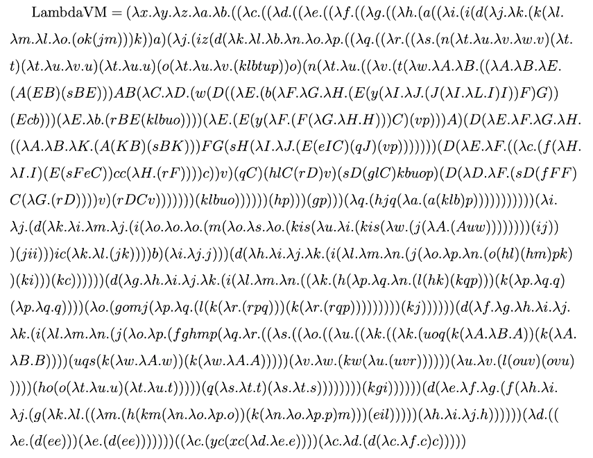

# lambda-8cc Details

## How is it Done?
To build lambda-8cc, I first made [LambdaVM](https://github.com/woodrush/lambdavm).
LambdaVM is a programmable virtual CPU with an arbitrarily configurable ROM/RAM address
and word size with an arbitrary number of registers, expressed as a single lambda calculus term.
LambdaVM is also a self-contained project where you can enjoy assembly programming in lambda calculus.

Despite its rich capability, LambdaVM has a compact lambda calculus term:



This 1-page lambda calculus term single-handedly handles the 18,506-page assembly to run lambda-8cc.
The assembly instructions are encoded as lambda terms. Each newline in the PDF represents one instruction.

The image at the top of [README.md](README.md) shows LambdaVM drawn as a [lambda diagram](http://tromp.github.io/cl/diagrams.html).

Based on LambdaVM, I built lambda-8cc by porting the C compiler [8cc](https://github.com/rui314/8cc) written in C by [Rui Ueyama](https://github.com/rui314) to LambdaVM.
This is done by compiling 8cc's C source code to an assembly for LambdaVM.
To do this, I modified the [ELVM](https://github.com/shinh/elvm) infrastructure written by [Shinichiro Hamaji](https://github.com/shinh)
to build a C compiler for LambdaVM, which I used to compile 8cc itself.


### How Does the Virtual CPU Work?
A detailed explanation is available in the [LambdaVM](https://github.com/woodrush/lambdavm) repo.

### Gluing Programs Together
lambda-8cc contains 8cc and elc, each from the 8cc and ELVM project.
To be precise, the version of 8cc enclosed in lambda-8cc is a modified version that also comes from the ELVM project.
8cc compiles C to ELVM assembly, and elc compiles ELVM assembly to various formats.

lambda-8cc compiles C to x86 and other formats in one pass by gluing these programs together.
The glue is provided by out/lambda-8cc-main.lam, generated by src/lambda-8cc.cl.
lambda-8cc-main.lam is a wrapper lambda calculus program that parses the compilation options
and passes the standard input to either 8cc or elc, or both of them.


## Building From Source
### Requirements
- clang++ (Ubuntu clang version 14.0.0-1ubuntu1) (used for building uni++)
- gcc (11.2.0) (used for building lam2bin and asc2bin)
- ruby (3.0.2p107) (used for building 8cc.c and elc.c in ELVM)
- SBCL (2.1.11) (used for building lambda-8cc-main.lam)


### Building
lambda-8cc.lam can be built from source by simply running:

```sh
make lambda-8cc.lam
```


## Tests
### Build Test
The build test can be run by:

```sh
make build
```


### Compilation Test
The build and compilation tests can be run by:

```sh
make test
```

`make test` uses about 36 GB of memory.


### Self-Hosting Test
lambda-8cc is a port of [8cc](https://github.com/rui314/8cc).
It is also made by compiling 8cc using 8cc itself.
Therefore, given enough time and memory, lambda-8cc can compile its own C source code as well.
This makes lambda-8cc a self-hosting C compiler.

However, on currently existing lambda calculus interpreters, the RAM usage explodes for such large programs. 
It would be very exciting to have a lambda calculus interpreter that runs lambda-8cc in a practical time and memory.

When running `make lambda-8cc.lam`, the source files `build/8cc.c` and `build/elc.c` are created.
These are the files that are used to create `build/8cc.lam` and `build/elc.lam` which are linked to create `lambda-8cc.lam`.
Since the files `build/8cc.c` and `build/elc.c` are compilable by the x86-64 versions of 8cc and elc,
which is lambda-8cc itself, lambda-8cc.lam should be able to compile these C sources as well.

The following Make rule runs this exact procedure:

```sh
make test-self-host
```

This compiles 8cc.c and elc.c, the source codes for [8cc](https://github.com/rui314/8cc) and [elc](https://github.com/shinh/elvm/blob/master/target/elc.c) (a part of [ELVM](https://github.com/shinh/elvm)) using lambda-8cc, and compares its outputs with the results compiled by the x86-64 versions of 8cc and elc.
As mentioned in [README.md](README.md), since this takes a lot of time and memory, this test is still yet unconfirmed.


### A Full Lambda-Closed Build - Building lambda-8cc-main.lam with LambdaLisp
lambda-8cc.lam depends on three *.lam files, 8cc.lam, elc.lam, and lambda-8cc-main.lam.
8cc.lam, elc.lam are built from C as explained before.
Currently, build/lambda-8cc-main.lam is built by running src/lambda-8cc.cl on Common Lisp, which is a non-lambda-calculus tool.
However, src/lambda-8cc.cl is actually written as a polyglot program for my other project
[LambdaLisp](https://github.com/woodrush/lambdalisp), a Lisp interpreter implemented in lambda calculus.

Using LambdaLisp, lambda-8cc should be able to be built in a full lambda-closed build.
This is unconfirmed yet since it takes a lot of time, but it should be possible since the examples/lambdacraft.cl test is passing in the [LambdaLisp](https://github.com/woodrush/lambdalisp) repo.

lambda-8cc-main.lam can be built by running:

```sh
out/lambda-8cc-main-lambdaisp.lam
```

Testing if it matches the Common Lisp version can be done by:

```sh
make test-lambda-8cc-main-lambdaisp
```

This will build `out/lambda-8cc-main-lambdaisp.lam` using LambdaLisp and `diff` it with `build/lambda-8cc-main.lam`.
Replacing `build/lambda-8cc-main.lam` with `out/lambda-8cc-main-lambdaisp.lam`, you can build the entire lambda-8cc.lam term by solely using tools built on lambda calculus.


## Programming in Lambda Calculus
In my other project [LambdaLisp](https://github.com/woodrush/lambdalisp),
I implemented a Lisp interpreter featuring closures and object-oriented programming in untyped lambda calculus.
A thorough explanation of techniques used in this project is explained in [my blog post](https://woodrush.github.io/blog/lambdalisp.html) about LambdaLisp.
A lot of techniques explained here are used to make lambda-8cc as well.


## Dependent Projects
lambda-8cc is a combination of the following 3 projects:

- [LambdaVM](https://github.com/woodrush/lambdavm) (written by the author of this repository (lambda-8cc), Hikaru Ikuta [@woodrush](https://github.com/woodrush))
  - LambdaVM is a virtual CPU with the Harvard Architecture supporting an extended [ELVM](https://github.com/shinh/elvm) instruction set written in untyped lambda calculus.
  - The VM has an arbitrarily configurable ROM/RAM address bit size and word size, and an arbitrarily configurable number of registers. In lambda-8cc, it is configured to a 24-bit machine with 6 registers to emulate ELVM in lambda calculus.
- [ELVM](https://github.com/shinh/elvm)
  - Written by Shinichiro Hamaji [@shinh](https://github.com/shinh)
  - ELVM (the Esoteric Language Virtual Machine) is a virtual machine architecture for compiling C to a rich set of [esoteric programming languages](https://en.wikipedia.org/wiki/Esoteric_programming_language).
  - I (@woodrush) implemented ELVM's lambda calculus backend by integrating LambdaVM into ELVM.
  - lambda-8cc ports [elc](https://github.com/shinh/elvm/blob/master/target/elc.c), a part of ELVM, to lambda calculus, using the ELVM lambda calculus backend. `elc` compiles ELVM assembly to various languages including x86 and lambda calculus.
- [8cc](https://github.com/rui314/8cc)
  - Written by Rui Ueyama [@rui314](https://github.com/rui314)
  - 8cc is a self-hosting C11 compiler written in C, with a minimal source code size. It is able to compile its own source code, 8cc.c.
  - ELVM uses 8cc to compile C to ELVM assembly. lambda-8cc ports this ELVM version of 8cc to lambda calculus.


## Detailed Stats
Detailed stats for the compilation time and memory usage on [Melvin Zhang](https://github.com/melvinzhang)'s [lambda calculus interpreter](https://github.com/melvinzhang/binary-lambda-calculus) is summarized here:

| Program                              | Compilation Time (a.s + a.out) | Max. Compilation RAM Usage (a.s, a.out) | x86 Binary Size         |
|--------------------------------------|--------------------------------|-----------------------------------------|-------------------------|
| [putchar.c](./examples/putchar.c)    | 1.8 min (1.5 min + 0.3 min)    | 31 GB (31 GB, 7 GB)                     | 342 bytes               |
| [hello.c](./examples/hello.c)        | 2.4 min (1.6 min + 0.8 min)    | 42 GB (42 GB, 22 GB)                    | 802 bytes               |
| [echo.c](./examples/echo.c)          | 2.5 min (1.8 min + 0.7 min)    | 46 GB (46 GB, 17 GB)                    | 663 bytes               |
| [rot13.c](./examples/rot13.c)        | 7.7 min (5.0 min + 2.7 min)    | 84 GB (84 GB, 65 GB)                    | 2,118 bytes             |
| [fizzbuzz.c](./examples/fizzbuzz.c)  | 49.7 min (22.2 min + 27.5 min) | 240 GB (177 GB, 240 GB)                 | 5,512 bytes             |
| [primes.c](./examples/primes.c)      | 53.0 min (24.0 min + 29.0 min) | 241 GB (172 GB, 241 GB)                 | 5,500 bytes             |

| Program                              | One-Pass Compilation Time      | One-Pass Max. Compilation RAM Usage     |
|--------------------------------------|--------------------------------|-----------------------------------------|
| [putchar.c](./examples/putchar.c)    |                                |                                         |
| [hello.c](./examples/hello.c)        |                                |                                         |
| [echo.c](./examples/echo.c)          |                                |                                         |
| [rot13.c](./examples/rot13.c)        | 7.8 min                        | 145 GB                                  |
| [fizzbuzz.c](./examples/fizzbuzz.c)  |                                |                                         |
| [primes.c](./examples/primes.c)      |                                |                                         |

## What is lambda-8cc.Blc?
lambda-8cc.Blc is lambda-8cc.lam ([./bin/lambda-8cc.lam.zip](./bin/lambda-8cc.lam.zip)) written in [binary lambda calculus](https://tromp.github.io/cl/Binary_lambda_calculus.html#Lambda_encoding) notation.
It is built as:

```sh
cat lambda-8cc.lam | bin/lam2bin | bin/asc2bin > lambda-8cc.Blc
```

lam2bin is a utility that converts plaintext lambda calculus notation such as `\x.x` to [binary lambda calculus](https://tromp.github.io/cl/Binary_lambda_calculus.html#Lambda_encoding) notation,
written by [Justine Tunney](https://github.com/jart) (available at [https://justine.lol/lambda/](https://justine.lol/lambda/)).
Binary lambda calculus (BLC) is a highly compact notation for writing lambda calculus terms using only `0` and `1`, proposed by [John Tromp](https://github.com/tromp).
Any lambda term with an arbitrary number of variables can be rewritten to BLC notation.
For example, $\lambda x.x$ becomes `0010`.
I've written details on the BLC notation in [one of my blog posts](https://woodrush.github.io/blog/lambdalisp.html#the-binary-lambda-calculus-notation).

[asc2bin](https://github.com/woodrush/lambda-calculus-devkit/blob/main/src/asc2bin.c) is a utility that packs the 0/1 BLC bitstream in ASCII to a byte stream.
Using this tool, the encoding `0010` for $\lambda x.x$ becomes only half a byte.
The interpreter uni++ accepts lambda terms in the byte-packed BLC format, converted above using lam2bin and asc2bin.

The output of `cat lambda-8cc.lam | bin/lam2bin` is available as [./bin/lambda-8cc.blc.zip](./bin/lambda-8cc.blc.zip).
Note that this is different from the uppercase lambda-8cc.Blc after passing it to asc2bin.

All in all, the conversion from lambda-8cc.lam to lambda-8cc.Blc is simply a transformation of notation for a format that's accepted by the interpreter uni++.


## About rot13.lam
[rot13.c](examples/rot13.c) compiles to [rot13.lam](out/rot13.lam), which runs on the same lambda calculus interpreter used to run lambda-8cc itself.

The first line in [rot13.lam](out/rot13.lam) is [LambdaVM](https://github.com/woodrush/lambdavm).
The following few lines are memory initialization values.
The next lines with indentation are the instruction list shown in [rot13.s](out/rot13.s) encoded as lambda calculus terms
passed to LambdaVM.

rot13.lam can be run on the [IOCCC](https://www.ioccc.org/) 2012 ["Most functional"](https://www.ioccc.org/2012/tromp/hint.html) binary lambda calculus interpreter written by [John Tromp](https://github.com/tromp).
It can be used to decipher its hint message [how13](https://www.ioccc.org/2012/tromp/how13), uncovering some of the secrets of the magical lambda calculus interpreter which its [source](https://www.ioccc.org/2012/tromp/tromp.c) is in shape of a λ:

```sh
wget https://www.ioccc.org/2012/tromp/tromp.c
gcc -Wall -W -std=c99 -O2 -m64 -DInt=long -DA=9999999 -DX=8 tromp.c -o tromp

wget https://www.ioccc.org/2012/tromp/how13

cat rot13.lam | bin/lam2bin | bin/asc2bin > rot13.Blc
cat rot13.Blc how13 | ./tromp
```

These commands run on Linux. Building `tromp` on a Mac is a little tricky but possible - I've covered the details [here](https://github.com/woodrush/lambdalisp#building-tromp-on-a-mac).

